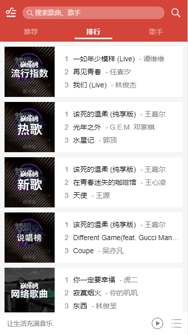
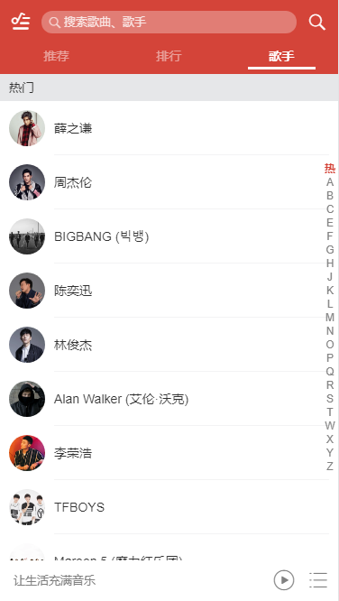
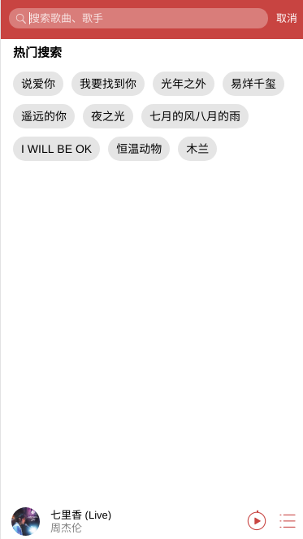

# music-player 

算是学习Vue2.0的第二个项目，基本上是界面是模仿的网易云，但是交互逻辑更像qq音乐，目前项目的数据来源是qq音乐，但是已经崩了一个音乐资源，所以用的是一个大佬的接口 [BZQLL](https://www.bzqll.com/2018/10/39.html)。接下来打算在搭完服务器后上线项目。

[浏览地址](http://www.nirean.cn) 

ios端第一次播放音乐需要在页面随机点击 电脑端请在手机模式下体验

# 技术栈

* vue + vuex + router 
* better-scroll (页面上下滑动 也可用于 左右滑动)
* vue-lazyload (懒加载)
* swiper (页面左右滑动)
* axios (请求数据)
* good-storage (localStorage的包装)


# 框架设计

* header 头部 嵌入了 搜索栏 以及 用户中心
* tab 用于3个页面的切换
* component 放入了3个大组件，分别是推荐、排行、歌手
* player 播放器 通过vuex来控制是否显示大播放器还是小播放器
* confirm 用于显示 提示信息 或者 歌曲列表，比如 添加歌曲成功 删除成功 是否删除歌曲 等 
（主要时为了能保证它能显示在界面最顶层才出此下策）

## 主界面

通过swiper实现3个tab左右滑动切换，能实现一级路由，二级路由就不行了。
主要参考我的一个[demo](https://github.com/zzNire/RouterSwiper/commits/master)

# 滑动条样式的改变
主要通过
```
this.mySwiper.scrollbar.$el.css({}) //整个滚动条
this.mySwiper.scrollbar.$dragEl.css({}) //高亮部分
```
兼容情况比较坑，记得设置 `width：100% left：0` 否则会被默认值覆盖

# 项目设计

主要分为五个大块
* 推荐页面
* 排行页面
* 歌手页面
* 搜索页面
* 播放器


# 推荐页面
* 滑动推荐
* 歌单

## 数据请求
直接通过JsonP请求，可以获取 轮播图数据 和 推荐歌单
url:https://c.y.qq.com/musichall/fcgi-bin/fcg_yqqhomepagerecommend.fcg

## 滑动推荐

[Slider组件](./src/base/slider/slider.vue) 
通过Better-Scroll实现，在Slider中实现Better-Scroll的初始化以及参数设置。
通过SetTimeout实现轮播，为了循环播放，需要将组件宽度设置为两倍的单个图片大小

## 歌单
通过每个块设置为inline-block，设置宽度为33.33%来保证一行只有三个

通过如下设置来保存标题只有两行，多出来的显示省略号

父组件
```
    overflow: hidden;
    text-overflow: ellipsis;
```
文字
```
    display: -webkit-box;
    -webkit-line-clamp: 2;
    -webkit-box-orient: vertical;
    overflow: hidden;   
```
# 排行页面


实现比较简单 主要介绍数据请求来源

url：https://c.y.qq.com/v8/fcg-bin/fcg_myqq_toplist.fcg 

直接通过JsonP请求

>一个细节
在设定 `width：100%` 和 设定边距 的情况下，想要实现溢出显示省略号，需要设置 `box-sizing: border-box` 和设定 内边距 ，外边距不可行，这样内容的宽度就是P标签的宽度减去内边距 

# 歌手页面


## 数据请求

url: https://u.y.qq.com/cgi-bin/musicu.fcg


两个技术点
* 类别框在滑动过程中悬停在顶部
* 侧边快捷导航栏

## 类别框在滑动过程中悬停在顶部

主要通过一个固定在顶部的块实现，这个块会在每一个类滑动到起始位置或结束位置时，跟随scroll一起滑动，在切换类型时，改变文本内容，并重新回到顶部。

需要计算每一个类的高度，以便于判断是否滑动到边界位置。

滑动位置通过监听 Better-Scroll 的 scroll 事件。

## 侧边快捷导航栏 

通过监听Touch事件来实现
* touchstart 记录起始位置，通过高度跳转到相应的类别
* touchmove 计算偏移量，通过偏移量跳转到相应的类别
* touchend （未使用）


# 播放器实现

## 数据请求

* 歌曲请求  https://api.bzqll.com/music/tencent/url?key=579621905&id=${musicData.songmid}&br=192   mid

* 歌词请求  https://c.y.qq.com/lyric/fcgi-bin/fcg_query_lyric_new.fcg   mid

一个坑：项目中请求歌词的方法是写在Song对象内，但LocalStorage不会存储对象中的方法，在通过LocalStorage获取Song对象时需要重新赋上获取歌词的方法

## 数据传递

  通过vuex实现

  在其它地方选择歌曲，会将歌曲列表加入vuex中，在player中接受并播放

  歌曲的播放和暂停也通过vuex

  vuex中的playList表示当前播放顺序，sequrenceList表示列表初始顺序


## mini播放器
  判断是否有播放列表来改变显示内容

## 播放列表
  显示播放列表时，播放列表从下方移入，player中渐显一个黑色蒙版

  播放列表中的添加歌曲页面是写在player中 而不是播放列表组件

## max播放器


* 进度条
  * touchsatrt  记录下起始位置               e.touches[0].pageX
  * touchmove  记录下偏移量 并修改css
  * touchend  改变歌曲播放进度 
  * click 单击直接跳转到相应的播放进度         e.offsetX

* 左右滑动切换
  * touchsatrt  记录下起始位置 X，Y值  并置Ydirection为false表示进行左右滑动            e.touches[0].pageX pageY
  * touchmove  记录下X，Y方向上的偏移量 如果水平位移小于垂直方向 置Ydirection 为true 并开始移动
  * touchend  实现自动补充位移量 补充动画时间 

* 歌词
  * 使用的lyric-parser


## audio ios 无法自动播放
ios不允许在没有用户交互的情况下自动播放歌曲，所以通过一个Touch事件来播放歌曲。
我看了qq音乐的手机版页面，发现在点击歌曲进行播放时，播放器是直接出现在当前页面的，所以这个点击事件触发了当前页面audio的播放。
网易云的手机页面在点开一首歌之后并没有直接播放，需要用户点击播放按钮。
所以也解决这个问题，就需要重新考虑交互逻辑。

## div ios 被遮挡
ios中一个div内部的div高度是不允许超过父容器的，否则只会显示父容器高度的内容。
为了解决在70%高的播放列表中现实100%高的添加歌曲组件，将添加歌曲组建写在了Player组件中。

# 搜索栏实现



## 数据

  * 热门搜索词 url：https://c.y.qq.com/splcloud/fcgi-bin/gethotkey.fcg
       
  * 搜索请求 url：https://c.y.qq.com/soso/fcgi-bin/search_for_qq_cp


## 搜索框放大缩小

```
 this.$refs.middle.style.width = maxWidth + 'px';
 this.$refs.middle.style.transition = 'width 0.4s';
```

需要同时设置搜索框的css
```
  position: absolute;
  right: 46px;
```

左右两边的图标通过 vue的transition实现  `mode="out-in"` 


## 数据传递
* vuex 传递 搜索页码
* props 传递 搜索内容 搜索结果

## 搜索历史

在每次搜索后将搜索结果存储到vuex LocalStorage中


## 搜索
通过两种方式搜索
* 输入框输入文本
    为了防止每次输入文笔自动开始搜索，添加了一个搜索提示页面
* 点击搜索关键词 搜索历史
    跳过搜索提示页面，直接显示搜索结果

## 在添加歌曲中复用搜索框
通过传递一个searchMode值，来实现不同的功能

#复用的基本组件

# 歌单列表 
主要实现列表上滑 封面上移并模糊

* 取消溢出隐藏，在列表上滑的过程中同时移动一个白色背景的div。

* 同时将封面图片以及文字上移。

* 在移动到达顶部时，停止移动

* 通过监听better-scroll的scroll事件来时事获取位移量


## Build Setup

``` bash
# install dependencies
npm install

# serve with hot reload at localhost:8080
npm run dev

# build for production with minification
npm run build

# build for production and view the bundle analyzer report
npm run build --report

# run unit tests
npm run unit

# run e2e tests
npm run e2e

# run all tests
npm test
```

For a detailed explanation on how things work, check out the [guide](http://vuejs-templates.github.io/webpack/) and [docs for vue-loader](http://vuejs.github.io/vue-loader).
